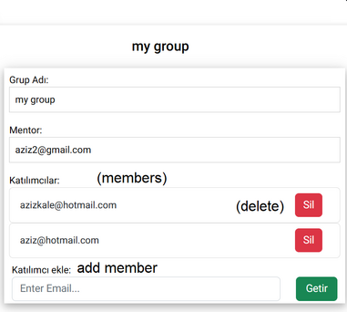
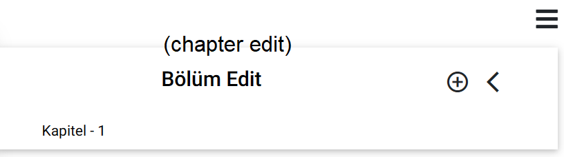
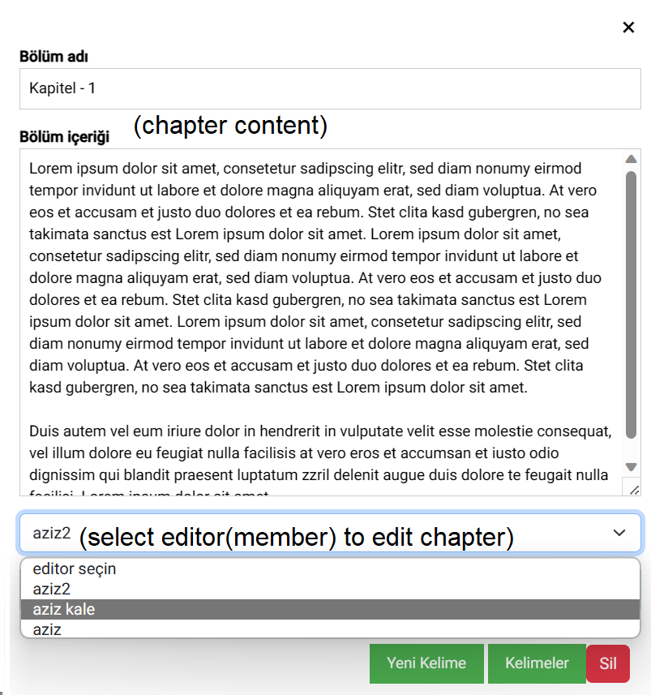
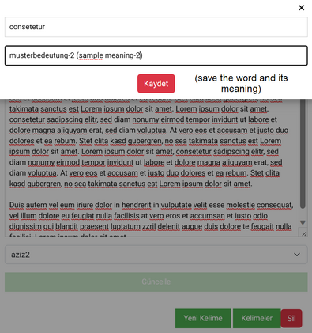
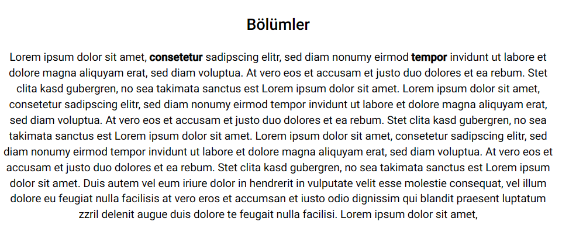
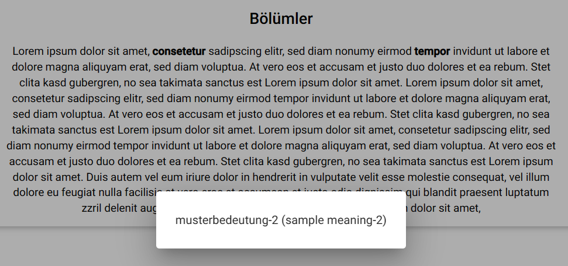

# Easy Read

Easy Read is an e-book project. You can make it easier to read a book in foreign language for your customers or every people.

All you have to do is upload the chapters of the book to Easy Read and add the meanings of some words by using Easy Read.

You can make it by yourself or you can make your team, you can distribute the task among your team.
#
[https://mywebsite-3f527.firebaseapp.com/display/displaypir](https://mywebsite-3f527.firebaseapp.com/display/displaypir)
 
 ### create your editor-team 

### add or remove member how you wish

### select the chapter of the book to edit

### manipulate the content of chapter and assign an editor to edit this chapter

### just select a word to add its meaning

### the words which was added its meaning display bold

### and just click to learn it

